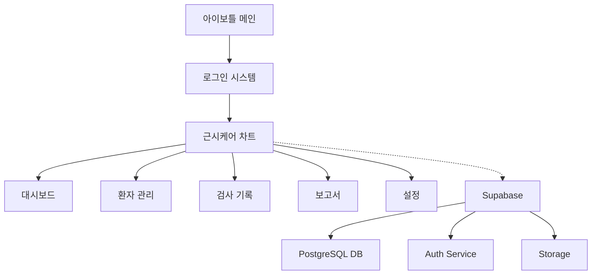
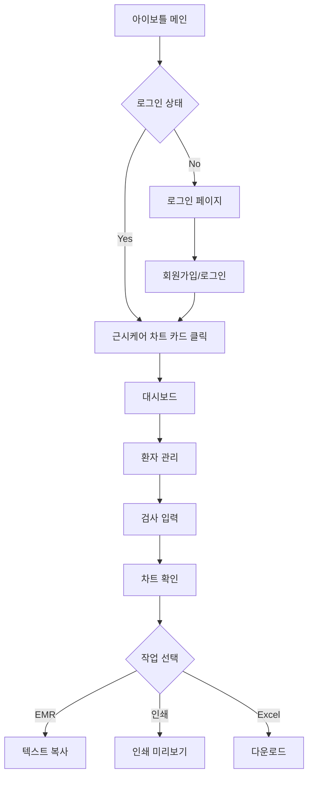
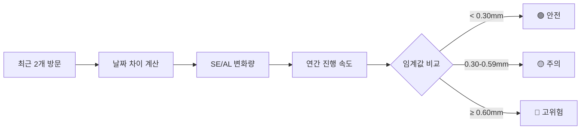

# 근시케어 차트 (MyoCare Chart) PRD v2.0

> **문서 버전**: 2.0.0  
> **작성일**: 2025년 6월 25일  
> **최종 수정**: 2025년 6월 25일  
> **상태**: 작성 중  
> **개발 방식**: Claude Code 바이브 코딩  
> **예상 개발 기간**: 4-5주 (전체 시스템)

## 1. 프로젝트 개요

### 1.1 목적 및 배경
- **제품명**: 근시케어 차트 (MyoCare Chart) - 아이보틀 통합 시스템
- **핵심 목적**: 소아 근시 환자의 체계적인 관리 및 진행 추적을 위한 종합 관리 시스템
- **해결 과제**: 
  - 다수 환자의 근시 진행 데이터를 효율적으로 관리
  - 위험도 기반 환자 분류 및 추적 관리
  - EMR 연동을 위한 표준화된 기록 생성
  - 시각적 차트를 통한 직관적인 진행 상황 파악

### 1.2 핵심 가치
- **효율성**: 환자 데이터 입력 및 관리 시간 단축
- **정확성**: 자동 계산 및 위험도 분석으로 오류 감소
- **시각화**: 복잡한 검사 데이터를 이해하기 쉬운 그래프로 표현
- **통합성**: 아이보틀 플랫폼 내 완벽한 통합

### 1.3 예상 사용자
- **1차 사용자**: 안과 전문의
- **2차 사용자**: 안과 전공의, 검안사
- **3차 사용자**: 간호사, 의료 보조 인력

### 1.4 성공 지표
- 환자 등록 시간 < 1분
- 검사 데이터 입력 시간 < 2분
- 차트 생성 시간 < 1초
- 대시보드 로딩 시간 < 2초
- 사용자 만족도 > 90%

## 2. 시스템 아키텍처

### 2.1 기술 스택
- **Frontend**: Next.js 15 + React 19 + TypeScript 5
- **스타일링**: TailwindCSS 4 + Shadcn/ui
- **차트**: Recharts
- **상태관리**: React Hooks + Context API
- **백엔드**: Supabase (PostgreSQL + Auth + Storage)
- **배포**: Vercel

### 2.2 시스템 구성도


## 3. 데이터베이스 설계

### 3.1 테이블 구조

#### users (의료진 계정)
```sql
CREATE TABLE users (
    id UUID PRIMARY KEY DEFAULT uuid_generate_v4(),
    email TEXT UNIQUE NOT NULL,
    name TEXT NOT NULL,
    clinic_name TEXT,
    license_number TEXT,
    clinic_address TEXT,
    clinic_phone TEXT,
    clinic_logo_url TEXT,
    created_at TIMESTAMP DEFAULT NOW(),
    updated_at TIMESTAMP DEFAULT NOW(),
    settings JSONB DEFAULT '{}'::jsonb
);
```

#### patients (환자 정보)
```sql
CREATE TABLE patients (
    id UUID PRIMARY KEY DEFAULT uuid_generate_v4(),
    user_id UUID REFERENCES users(id),
    name TEXT NOT NULL,
    birth_date DATE NOT NULL,
    gender TEXT CHECK (gender IN ('M', 'F')),
    phone TEXT,
    memo TEXT,
    created_at TIMESTAMP DEFAULT NOW(),
    updated_at TIMESTAMP DEFAULT NOW(),
    deleted_at TIMESTAMP,
    UNIQUE(user_id, name, birth_date)
);
```

#### myocare_visits (검사 기록)
```sql
CREATE TABLE myocare_visits (
    id UUID PRIMARY KEY DEFAULT uuid_generate_v4(),
    patient_id UUID REFERENCES patients(id),
    visit_date DATE NOT NULL,
    treatment_method TEXT NOT NULL,
    od_sph DECIMAL(4,2),
    od_cyl DECIMAL(4,2),
    od_se DECIMAL(4,2),
    od_al DECIMAL(5,2),
    os_sph DECIMAL(4,2),
    os_cyl DECIMAL(4,2),
    os_se DECIMAL(4,2),
    os_al DECIMAL(5,2),
    new_glasses BOOLEAN DEFAULT FALSE,
    created_at TIMESTAMP DEFAULT NOW(),
    updated_at TIMESTAMP DEFAULT NOW(),
    created_by UUID REFERENCES users(id)
);
```

#### user_settings (사용자 설정)
```sql
CREATE TABLE user_settings (
    id UUID PRIMARY KEY DEFAULT uuid_generate_v4(),
    user_id UUID REFERENCES users(id),
    feature TEXT NOT NULL,
    settings JSONB DEFAULT '{}'::jsonb,
    updated_at TIMESTAMP DEFAULT NOW(),
    UNIQUE(user_id, feature)
);
```

#### audit_logs (변경 이력)
```sql
CREATE TABLE audit_logs (
    id UUID PRIMARY KEY DEFAULT uuid_generate_v4(),
    user_id UUID REFERENCES users(id),
    table_name TEXT NOT NULL,
    record_id UUID NOT NULL,
    action TEXT CHECK (action IN ('INSERT', 'UPDATE', 'DELETE')),
    old_data JSONB,
    new_data JSONB,
    created_at TIMESTAMP DEFAULT NOW()
);
```

### 3.2 인덱스 설계
```sql
-- 환자 검색
CREATE INDEX idx_patients_name ON patients(user_id, name) WHERE deleted_at IS NULL;
CREATE INDEX idx_patients_birth ON patients(user_id, birth_date) WHERE deleted_at IS NULL;

-- 방문 기록 조회
CREATE INDEX idx_visits_patient_date ON myocare_visits(patient_id, visit_date DESC);
CREATE INDEX idx_visits_created_by ON myocare_visits(created_by, visit_date DESC);

-- 대시보드 통계
CREATE INDEX idx_visits_treatment ON myocare_visits(treatment_method);
```

### 3.3 Row Level Security (RLS)
```sql
-- 환자 데이터 접근 제한
ALTER TABLE patients ENABLE ROW LEVEL SECURITY;
CREATE POLICY patients_policy ON patients
    FOR ALL USING (user_id = auth.uid());

-- 검사 기록 접근 제한
ALTER TABLE myocare_visits ENABLE ROW LEVEL SECURITY;
CREATE POLICY visits_policy ON myocare_visits
    FOR ALL USING (created_by = auth.uid());
```

## 4. 기능 요구사항

### 4.1 우선순위 매트릭스

| 우선순위 | 기능 | 설명 | 예상 공수 |
|---------|------|------|-----------|
| 🔴 P0 | 사용자 인증 | 로그인/로그아웃, 회원가입 | 3일 |
| 🔴 P0 | 환자 CRUD | 환자 등록/수정/삭제/검색 | 3일 |
| 🔴 P0 | 검사 데이터 입력 | 방문 기록 및 검사 결과 입력 | 3일 |
| 🔴 P0 | 기본 차트 표시 | 시계열 SE/AL 차트 | 3일 |
| 🟡 P1 | 위험도 분석 | 진행 속도 계산 및 색상 표시 | 2일 |
| 🟡 P1 | 대시보드 | 전체 환자 통계 및 요약 | 3일 |
| 🟡 P1 | EMR 복사 | 설정 기반 텍스트 생성 | 1일 |
| 🟢 P2 | 인쇄 기능 | A4 최적화 인쇄 | 2일 |
| 🟢 P2 | Excel 내보내기 | 개별 환자 데이터 다운로드 | 1일 |
| 🟢 P2 | 설정 관리 | 임계값, 색상, EMR 템플릿 | 2일 |
| 🔵 P3 | 데이터 복구 | 삭제 데이터 복원 | 1일 |
| 🔵 P3 | 변경 이력 | 수정 내역 추적 | 1일 |

### 4.2 핵심 기능 상세

#### 4.2.1 대시보드
- **전체 환자 수**: 등록된 총 환자 수
- **위험도별 분류**: 
  - 고위험 (Red): 최근 AL 진행 ≥ 0.60 mm/yr
  - 중위험 (Yellow): 최근 AL 진행 0.30-0.59 mm/yr
  - 정상 (Green): 최근 AL 진행 < 0.30 mm/yr
- **치료 방법별 통계**: 8가지 치료법별 환자 수
- **데모 영상 링크**: YouTube 예시 영상

#### 4.2.2 환자 관리
- **환자 목록**:
  - 정렬: 최근 방문이 오래된 순
  - 검색: 이름으로 검색
  - 표시: 이름, 생년월일, 최근 방문, 위험도, 치료법
- **신규 환자 등록**:
  - 필수: 이름, 생년월일
  - 선택: 치료 방법, 메모
  - 중복 체크: 이름+생년월일
- **환자 정보 수정/삭제**

#### 4.2.3 검사 기록 입력
- **방문 기록**:
  - 검사일 (Date picker)
  - 치료 방법 (드롭다운)
  - 양안 굴절 검사 (Sph, Cyl)
  - S.E. 자동 계산: Sph + 0.5 × Cyl
  - 안축장 측정값
  - 새 안경 처방 여부 (체크박스)
- **데이터 검증**:
  - 숫자 범위 확인
  - 필수 항목 검증

#### 4.2.4 진행 그래프 및 보고서
- **차트 구성**:
  - 상단: S.E. 변화 그래프
  - 하단: 안축장 변화 그래프
  - 우안(파랑 실선), 좌안(주황 점선)
- **위험도 표시**:
  - 측정점 색상으로 진행 속도 표시
  - 치료법별 배경색 구분
  - 안경 처방 아이콘(👓) 표시
- **하단 표**:
  - 검사일별 측정값
  - 연간 진행 속도 (색상 강조)
- **EMR 복사**: 설정 기반 텍스트 생성
- **인쇄**: A4 최적화 레이아웃

### 4.3 설정 관리
```json
{
  "myocare": {
    "thresholds": {
      "se_yellow": 0.75,
      "se_red": 1.50,
      "al_yellow": 0.30,
      "al_red": 0.60
    },
    "treatment_colors": {
      "아트로핀 0.042": "#E3F2FD",
      "아트로핀 0.05": "#BBDEFB",
      "아트로핀 0.063": "#90CAF9",
      "아트로핀 0.125": "#64B5F6",
      "드림렌즈": "#E8D4F2",
      "마이사이트": "#FFE0B2",
      "DIMS안경": "#C8E6C9",
      "병행치료": "#F8BBD0"
    },
    "emr_template": {
      "include_treatment": true,
      "include_se": true,
      "include_al": true,
      "include_risk": true,
      "include_glasses": true,
      "follow_up_text": "4개월 뒤 경과관찰"
    }
  }
}
```

## 5. 사용자 플로우

### 5.1 전체 시스템 플로우


### 5.2 위험도 계산 플로우


## 6. UI/UX 설계

### 6.1 디자인 시스템
- **색상 팔레트**:
  - Primary: Blue (#3B82F6)
  - Secondary: Orange (#F97316)
  - Success: Green (#10B981)
  - Warning: Yellow (#F59E0B)
  - Danger: Red (#EF4444)
- **타이포그래피**: 
  - 본문: Pretendard
  - 숫자: Mono 폰트
- **레이아웃**:
  - 대시보드: 카드 기반 그리드
  - 환자 관리: 테이블 리스트
  - 검사 입력: 좌우 분할 (입력 40% + 미리보기 60%)

### 6.2 반응형 대응
- **Desktop (1024px+)**: 전체 기능
- **Tablet (768-1023px)**: 레이아웃 조정
- **Mobile (<768px)**: 읽기 전용

### 6.3 컴포넌트 구조
```
components/
├── myocare/
│   ├── dashboard/
│   │   ├── StatsCard.tsx
│   │   ├── TreatmentChart.tsx
│   │   └── RiskSummary.tsx
│   ├── patients/
│   │   ├── PatientList.tsx
│   │   ├── PatientForm.tsx
│   │   └── SearchBar.tsx
│   ├── visits/
│   │   ├── VisitForm.tsx
│   │   ├── VisitHistory.tsx
│   │   └── DataValidation.tsx
│   ├── charts/
│   │   ├── ProgressChart.tsx
│   │   ├── DataTable.tsx
│   │   └── RiskIndicator.tsx
│   └── settings/
│       ├── ThresholdSettings.tsx
│       ├── ColorSettings.tsx
│       └── EMRTemplate.tsx
└── common/
    ├── Layout.tsx
    ├── Navigation.tsx
    └── LoadingSpinner.tsx
```

## 7. 개발 계획

### 7.1 개발 단계별 일정

#### Phase 0: 기반 구축 (3일)
- **Day 1**: Supabase 프로젝트 설정 및 DB 스키마 생성
- **Day 2**: 인증 시스템 연동 (아이보틀 통합)
- **Day 3**: 기본 라우팅 및 레이아웃 구성 

#### Phase 1: 핵심 기능 (1주)
- **Day 4-5**: 환자 CRUD 구현
- **Day 6-7**: 검사 데이터 입력 폼
- **Day 8-10**: 기본 차트 구현 (Recharts)

#### Phase 2: 분석 기능 (1주)
- **Day 11-12**: 위험도 계산 로직
- **Day 13-15**: 대시보드 구현
- **Day 16-17**: EMR 복사 기능

#### Phase 3: 부가 기능 (1주)
- **Day 18-19**: 인쇄 최적화
- **Day 20**: Excel 내보내기
- **Day 21-22**: 설정 페이지

#### Phase 4: 마무리 (3일)
- **Day 23**: 데이터 복구/이력 기능
- **Day 24**: 통합 테스트
- **Day 25**: 버그 수정 및 최적화

### 7.2 데모 포인트
- **Week 1 End**: 환자 등록 및 데이터 입력 데모
- **Week 2 End**: 차트 및 대시보드 데모
- **Week 3 End**: 전체 시스템 데모
- **Week 4 End**: 최종 검수

### 7.3 개발 체크리스트
- [ ] Supabase 프로젝트 생성
- [ ] 데이터베이스 스키마 구현
- [ ] RLS 정책 설정
- [ ] 인증 시스템 연동
- [ ] 환자 관리 CRUD
- [ ] 검사 데이터 입력
- [ ] 차트 컴포넌트 구현
- [ ] 위험도 계산 로직
- [ ] 대시보드 통계
- [ ] EMR 복사 기능
- [ ] 인쇄 스타일시트
- [ ] Excel 내보내기
- [ ] 설정 관리
- [ ] 테스트 작성
- [ ] 성능 최적화

## 8. 리스크 관리

| 리스크 | 영향도 | 대응방안 |
|--------|--------|----------|
| Supabase 연동 복잡도 | 높음 | MCP 도구 활용 및 단계별 구현 |
| 차트 성능 이슈 | 중간 | 데이터 포인트 제한 및 가상화 |
| 인쇄 레이아웃 | 중간 | CSS 프린트 미디어 철저한 테스트 |
| 모바일 대응 | 낮음 | 읽기 전용으로 범위 제한 |

## 9. 성공 기준

### 9.1 기능적 요구사항
- ✅ 모든 P0 기능 완성도 100%
- ✅ P1 기능 완성도 90% 이상
- ✅ 데이터 정확성 100%

### 9.2 비기능적 요구사항
- ✅ 페이지 로딩 시간 < 2초
- ✅ 차트 렌더링 < 1초
- ✅ 동시 사용자 10명 이상 지원
- ✅ 데이터 보안 (RLS 적용)

### 9.3 사용성 요구사항
- ✅ 직관적인 UI (교육 없이 사용 가능)
- ✅ 오류 메시지 명확성
- ✅ 반응형 디자인 (태블릿 이상)

## 10. 참고 자료

- [기획서 원본](/mnt/c/Users/user/.cursor/eyebottle/PRD_Ref/MyocareChart-Planning-250625.md)
- [UI 디자인 참고 이미지](PRD_Ref/*.webp)
- [데모 영상](https://youtu.be/-Orv-jTXkSs)
- [Recharts 문서](https://recharts.org)
- [Supabase 문서](https://supabase.io/docs)

---

**다음 단계**: 
1. Supabase 프로젝트 생성 및 설정
2. 데이터베이스 스키마 구현
3. 기본 프로젝트 구조 설정