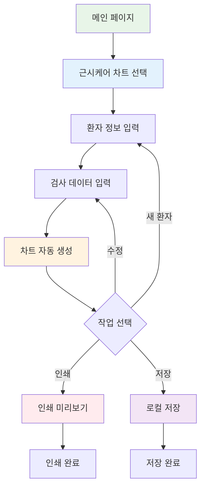
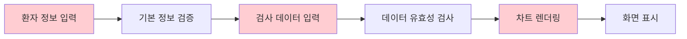
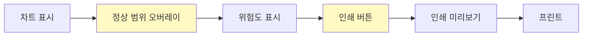

# 근시케어 차트 (MyoCare Chart) PRD

> **문서 버전**: 1.1.0  
> **작성일**: 2025년 6월 25일  
> **최종 수정**: 2025년 6월 25일  
> **상태**: 초안 대기 중  
> **개발 방식**: Claude Code 바이브 코딩  
> **예상 개발 기간**: 2-3주 (MVP)

## 1. 개요

### 1.1 목적 및 배경
- 소아 근시 진행을 시각적으로 추적하고 관리하는 차트 시스템
- 부모와 의료진이 근시 진행 상황을 직관적으로 파악
- 조기 개입 시점을 명확히 제시

### 1.2 핵심 가치
- **시각화**: 복잡한 검사 데이터를 이해하기 쉬운 그래프로 표현
- **예측**: 성장 곡선 기반 근시 진행 예측
- **교육**: 부모에게 근시 관리의 중요성 전달

### 1.3 예상 사용자
- 1차: 안과 의사
- 2차: 검안사, 간호사
- 3차: 환자 보호자

### 1.4 성공 지표
- 데이터 입력 시간 < 2분
- 차트 생성 시간 < 3초
- 사용자 만족도 > 85%

## 2. 기능 요구사항

### 2.1 우선순위 매트릭스

| 우선순위 | 기능 | 비즈니스 임팩트 | 기술 복잡도 | 예상 공수 |
|---------|------|----------------|------------|-----------|
| 🔴 P0 | 환자 정보 입력 폼 | 높음 (5/5) | 낮음 (2/5) | 1일 |
| 🔴 P0 | 검사 데이터 입력 | 높음 (5/5) | 보통 (3/5) | 2일 |
| 🔴 P0 | 기본 차트 표시 | 높음 (5/5) | 높음 (4/5) | 3일 |
| 🟡 P1 | 정상 범위 비교 | 높음 (4/5) | 보통 (3/5) | 2일 |
| 🟡 P1 | 인쇄 기능 | 높음 (4/5) | 보통 (3/5) | 2일 |
| 🟢 P2 | PDF 내보내기 | 보통 (3/5) | 보통 (3/5) | 2일 |
| 🟢 P2 | 데이터 저장/불러오기 | 보통 (3/5) | 낮음 (2/5) | 1일 |
| 🔵 P3 | 다국어 지원 | 낮음 (2/5) | 낮음 (2/5) | 2일 |

### 2.2 핵심 기능 (P0 - Critical)
- [ ] 환자 정보 입력 (이름, 나이, 성별, 차트번호)
- [ ] 검사 데이터 입력
  - [ ] 굴절검사 수치 (SE, 구면도수, 난시)
  - [ ] 안축장 측정값
  - [ ] 각막곡률 데이터
- [ ] 시계열 차트 표시

### 2.3 주요 기능 (P1 - High)
- [ ] 정상 범위 대비 표시
- [ ] 인쇄 기능

### 2.4 부가 기능 (P2-P3)
- [ ] PDF 내보내기
- [ ] 데이터 저장/불러오기
- [ ] 다국어 지원 (한/영)

### 2.5 시스템 요구사항
- **회원 시스템**: 불필요 (의료진 전용 로컬 사용)
- **결제 기능**: 불필요
- **관리자 기능**: 불필요 (로컬 데이터 관리)

### 2.6 제외 사항
- 자동 검사장비 연동
- 클라우드 동기화
- 모바일 앱

### 2.7 제약 사항
- 브라우저: Chrome, Edge 최신 버전
- 인쇄: A4 세로 방향 최적화

## 3. 사용자 시나리오

### 3.1 주요 사용 플로우



### 3.2 상세 사용자 여정

#### 🔴 P0: 핵심 플로우 (Week 1)


#### 🟡 P1: 분석 및 출력 플로우 (Week 2)


### 3.3 엣지 케이스
- 검사 데이터 누락 시 처리
- 비정상적인 수치 입력 시 경고
- 다중 검사일 데이터 관리

## 4. 기술 명세

### 4.1 데이터 모델
```typescript
interface PatientInfo {
  name: string;
  age: number;
  gender: 'M' | 'F';
  chartNumber: string;
}

interface ExamData {
  date: Date;
  rightEye: EyeData;
  leftEye: EyeData;
}

interface EyeData {
  sphericalEquivalent: number;
  sphere: number;
  cylinder: number;
  axialLength: number;
  keratometry: {
    k1: number;
    k2: number;
  };
}
```

### 4.2 기술 스택
- **Frontend Framework**: Next.js 15 + React 19 + TypeScript 5
- **스타일링**: TailwindCSS 4 + Shadcn/ui (기존 프로젝트와 통일)
- **차트 라이브러리**: Recharts (권장) 또는 Chart.js
- **상태 관리**: React Hooks (useState, useEffect)
- **데이터 저장**: 로컬 스토리지 (초기 버전)

### 4.3 API 설계
- 로컬 스토리지 기반 (초기 버전)
- 추후 서버 API 확장 고려

### 4.4 상태 관리
- React Context API 또는 Zustand
- 실시간 차트 업데이트

### 4.5 성능 요구사항
- 차트 렌더링: < 100ms
- 데이터 입력 반응: 즉시

## 5. UI/UX 설계

### 5.1 와이어프레임
```
+------------------+------------------+
|   환자 정보      |   차트 영역      |
|   입력 폼        |                  |
+------------------+                  |
|   검사 데이터    |   시계열 그래프   |
|   입력 폼        |                  |
+------------------+------------------+
|        액션 버튼 (인쇄, 저장)        |
+-------------------------------------+
```

### 5.2 디자인 시스템
- 기존 아이보틀 디자인 시스템 준수
- 검진결과 작성 시스템과 유사한 UI 패턴
  - 좌우 분할 레이아웃 (입력 40% + 차트 60%)
  - 상단 네비게이션 바
  - 글래스모피즘 효과
- 차트 색상: 우안(파랑), 좌안(빨강)
- 의료진 맞춤 색상 팔레트 (Slate & Blue)

### 5.3 반응형 고려사항
- 태블릿: 좌우 분할 유지
- 모바일: 상하 분할로 전환

### 5.4 접근성
- 키보드 네비게이션 지원
- 고대비 모드 옵션
- 스크린 리더 호환

## 6. 개발 계획

### 6.1 바이브 코딩 작업 분해 (2-5일 단위)

#### 📅 Week 1: 기반 구축 및 핵심 기능
**Day 1-2: 프로젝트 설정 및 입력 폼**
- 🔹 **작업 ID**: T-001
- 📝 **작업명**: 프로젝트 설정 및 라우팅 구성
- ⏱️ **예상 공수**: 0.5일
- 🔗 **의존성**: 없음
- **완료 조건**:
  - [ ] `/myocare-chart` 라우트 생성
  - [ ] 기본 레이아웃 구성
  - [ ] Recharts 라이브러리 설치

- 🔹 **작업 ID**: T-002  
- 📝 **작업명**: 환자 정보 입력 폼 구현
- ⏱️ **예상 공수**: 1일
- 🔗 **의존성**: T-001
- **완료 조건**:
  - [ ] 입력 폼 UI 구현
  - [ ] 유효성 검사 로직
  - [ ] Shadcn/ui 컴포넌트 활용

**Day 3-4: 검사 데이터 입력**
- 🔹 **작업 ID**: T-003
- 📝 **작업명**: 검사 데이터 입력 폼 구현
- ⏱️ **예상 공수**: 2일
- 🔗 **의존성**: T-002
- **완료 조건**:
  - [ ] 양안 데이터 입력 UI
  - [ ] 실시간 데이터 검증
  - [ ] 상태 관리 구현

**Day 5-7: 차트 구현**
- 🔹 **작업 ID**: T-004
- 📝 **작업명**: 기본 차트 렌더링
- ⏱️ **예상 공수**: 3일
- 🔗 **의존성**: T-003
- **완료 조건**:
  - [ ] Recharts 기반 시계열 차트
  - [ ] 양안 데이터 동시 표시
  - [ ] 반응형 차트 크기

🚩 **Week 1 데모 포인트**: 
- Day 3: 입력 폼 UI 데모
- Day 7: 차트 렌더링 데모

#### 📅 Week 2: 주요 기능 및 완성
**Day 8-9: 정상 범위 비교**
- 🔹 **작업 ID**: T-005
- 📝 **작업명**: 정상 범위 오버레이 구현
- ⏱️ **예상 공수**: 2일
- 🔗 **의존성**: T-004
- **완료 조건**:
  - [ ] 연령별 정상 범위 데이터
  - [ ] 차트에 범위 표시
  - [ ] 위험도 색상 코딩

**Day 10-11: 인쇄 기능**
- 🔹 **작업 ID**: T-006
- 📝 **작업명**: 인쇄 최적화 구현
- ⏱️ **예상 공수**: 2일
- 🔗 **의존성**: T-005
- **완료 조건**:
  - [ ] A4 인쇄 레이아웃
  - [ ] 인쇄 전용 스타일시트
  - [ ] 브라우저 인쇄 테스트

🚩 **Week 2 데모 포인트**: 
- Day 10: 전체 플로우 데모

#### 📅 Week 3: 부가 기능 및 마무리
**Day 12-13: 데이터 저장/불러오기**
- 🔹 **작업 ID**: T-007
- 📝 **작업명**: 로컬 스토리지 연동
- ⏱️ **예상 공수**: 1일
- 🔗 **의존성**: T-006
- **P2 기능**

**Day 14-15: 테스트 및 최적화**
- 🔹 **작업 ID**: T-008
- 📝 **작업명**: 통합 테스트 및 버그 수정
- ⏱️ **예상 공수**: 2일
- 🔗 **의존성**: 모든 작업

### 6.2 즉시 시작 가능한 작업
```bash
# 1. 라이브러리 설치
cd /mnt/c/Users/user/.cursor/eyebottle
npm install recharts

# 2. 라우트 생성
mkdir -p src/app/myocare-chart
touch src/app/myocare-chart/page.tsx

# 3. 컴포넌트 폴더 생성
mkdir -p src/components/myocare
```

### 6.3 개발 체크리스트
- [ ] 컴포넌트 구조 설계
- [ ] 데이터 모델 정의
- [ ] 입력 폼 구현
- [ ] 차트 라이브러리 선정 및 구현
- [ ] 인쇄 스타일시트 작성
- [ ] 단위 테스트 작성
- [ ] 통합 테스트 수행

### 6.4 테스트 계획
- 단위 테스트: 데이터 검증 로직
- 통합 테스트: 전체 플로우
- 사용성 테스트: 실제 의료진 대상

## 7. 리스크 및 대응방안

| 리스크 | 영향도 | 대응방안 |
|--------|--------|----------|
| 차트 라이브러리 호환성 | 높음 | 사전 POC 진행 |
| 인쇄 레이아웃 깨짐 | 중간 | CSS 프린트 미디어 쿼리 활용 |
| 데이터 정확성 | 높음 | 입력값 검증 강화 |

## 8. 참고 자료

- [WHO 근시 관리 가이드라인](https://www.who.int/publications/i/item/9789240000000)
- [대한안과학회 소아 근시 진료 지침](https://www.ophthalmology.org)
- [Recharts 차트 라이브러리 문서](https://recharts.org)

## 9. 기존 시스템과의 통합 고려사항

### 9.1 UI/UX 일관성
- **검진결과 작성 시스템과 동일한 패턴 적용**
  - 좌우 분할 레이아웃 (입력 40% + 차트 60%)
  - 상단 네비게이션 바 (홈으로 돌아가기)
  - 글래스모피즘 디자인 효과
  - 동일한 버튼 스타일 및 색상 테마

### 9.2 기술적 통합
- **공통 컴포넌트 재사용**
  - 환자 정보 입력 컴포넌트
  - 날짜 선택기
  - 인쇄 기능 로직
  - 유효성 검사 패턴

### 9.3 네비게이션 통합
- 메인 페이지의 기능 카드에서 직접 접근
- "마이오가드 그래프" → "근시케어 차트"로 명칭 변경
- 아이콘: 📊 (차트 아이콘 유지)

### 9.4 데이터 연동 가능성
- 향후 검진결과와 근시 데이터 통합 관리
- 환자 정보 공유 인터페이스 고려
- 통합 인쇄 기능 확장 가능

---

**다음 단계**: 기초 기획서 검토 후 상세 스펙 확정

**🚀 바로 시작하기**: 
```bash
npm install recharts
npx create-next-app@latest --typescript --tailwind
```